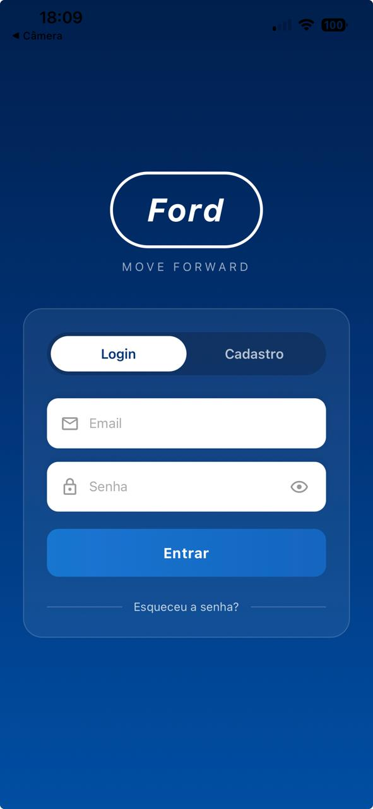
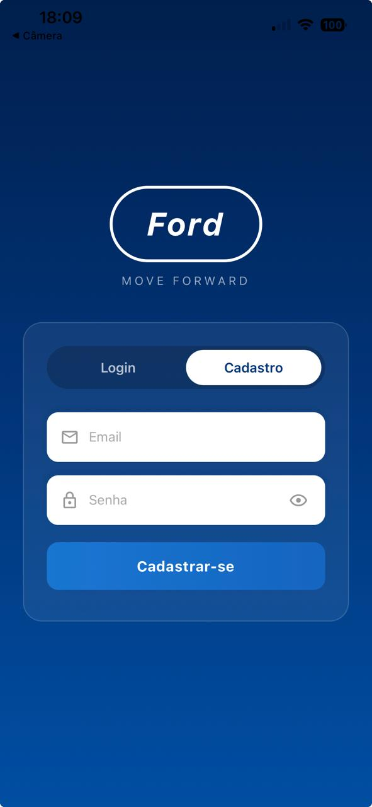
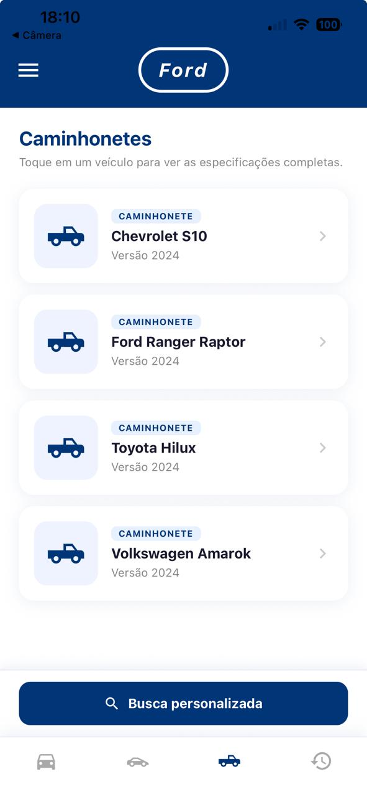
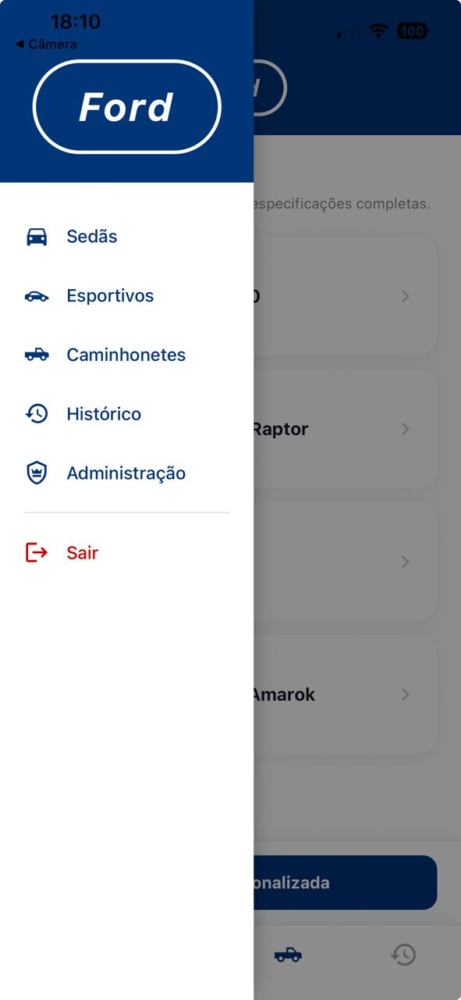
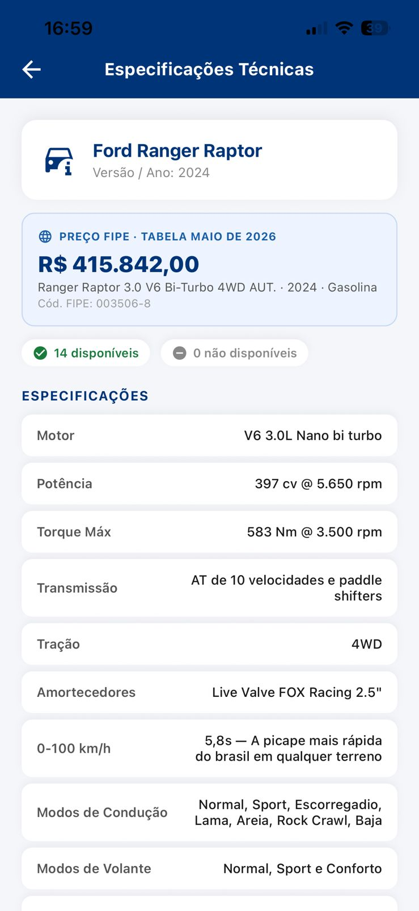
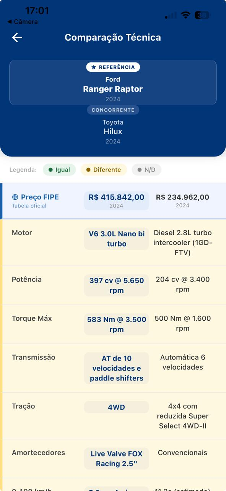
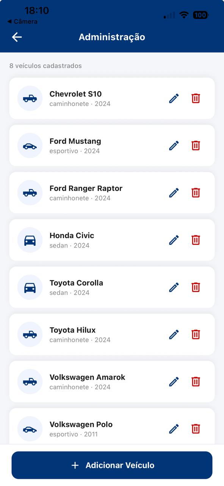
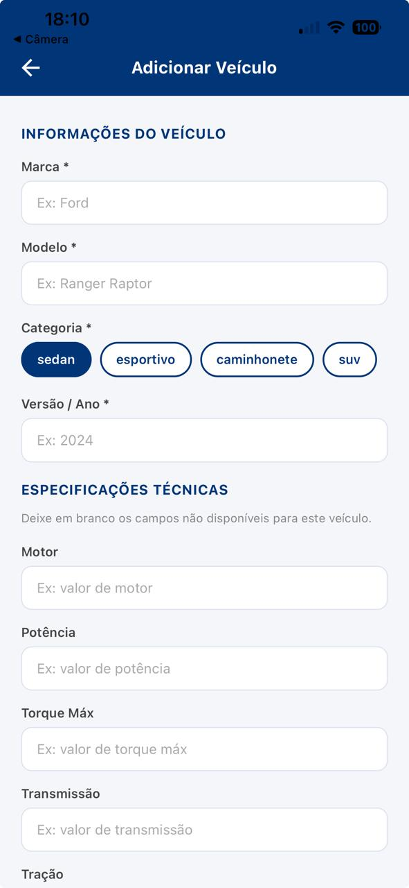

# Ford Challenge v1 — Mobile App

> Projeto desenvolvido para o **Ford FIAP 2026**, programa que conecta estudantes de tecnologia a desafios reais de negócio da Ford Motor Company.

---

## Integrantes do Grupo

| Nome | RM |
|---|---|
| Léo Masago | RM557768 |
| Eduardo Tomazela | RM556807 |
| Luiz Henrique Silva | RM555235 |

---

## Screenshots

<div align="center">

| Login | Cadastro | Recuperar Senha |
|:---:|:---:|:---:|
|  |  |  |

| Lista Caminhonetes | Menu Lateral | Especificações Técnicas |
|:---:|:---:|:---:|
|  |  |  |

| Comparação Técnica | Painel Admin | Adicionar Veículo |
|:---:|:---:|:---:|
|  |  |  |

</div>

---

## Sobre o Projeto

Este repositório contém a entrega da disciplina **Mobile Development and IoT** do Challenge Ford FIAP 2026.

O aplicativo foi desenvolvido em **React Native com Expo** e resolve o **Desafio 01 — Inteligência Competitiva Automotiva**: a partir de uma entrada simples (marca, modelo, versão e lista de atributos técnicos), o app consulta uma base de dados no Firebase Realtime Database e retorna uma lista padronizada de especificações técnicas, com campos explícitos para dados não disponíveis.

Além da consulta individual, o app oferece **comparação lado a lado** entre dois veículos, integração com a **Tabela FIPE** para preços de mercado em tempo real, e um **painel administrativo** para gestão da base de dados.

---

## Objetivo do Challenge

O programa **Ford & FIAP: Dados na Prática** une a excelência acadêmica da FIAP com a operação da Ford, trazendo líderes com cases focados em dados para otimizar decisões operacionais e melhorar a experiência do cliente.

### Desafio 01 — Inteligência Competitiva Automotiva

> Compreender o valor percebido pelo cliente em relação à concorrência exige dados precisos e extremamente organizados.

**Entradas obrigatórias:**
- Marca, Modelo e Versão do veículo
- Lista livre de atributos técnicos a pesquisar (14 atributos pré-definidos)

**Saída obrigatória:**
- Lista padronizada de especificações técnicas
- Formato sempre o mesmo, independente do veículo consultado
- Campos com dados ausentes exibidos explicitamente como "Não disponível"

**Validação:** o app entrega corretamente todas as especificações técnicas do **Ford Ranger Raptor 2024**.

---

## Tecnologias Utilizadas

| Tecnologia | Versão | Uso |
|---|---|---|
| [Expo](https://expo.dev/) | ~54.0.33 | Framework mobile multiplataforma |
| [React Native](https://reactnative.dev/) | 0.81.5 | Base do app mobile |
| [React](https://react.dev/) | 19.1.0 | Biblioteca de UI |
| [Expo Router](https://expo.github.io/router/) | ~4.x | Roteamento baseado em arquivos |
| [Firebase](https://firebase.google.com/) | ^12.12.0 | Autenticação e Realtime Database |
| [@react-native-async-storage/async-storage](https://react-native-async-storage.github.io/async-storage/) | ^2.x | Cache local e histórico de buscas |
| [expo-notifications](https://docs.expo.dev/versions/latest/sdk/notifications/) | SDK 54 | Notificações push locais |
| [expo-linear-gradient](https://docs.expo.dev/versions/latest/sdk/linear-gradient/) | SDK 54 | Gradientes visuais |
| [@expo/vector-icons](https://icons.expo.fyi/) | SDK 54 | Ícones (MaterialCommunityIcons) |
| [react-native-dotenv](https://github.com/goatandsheep/react-native-dotenv) | ^3.4.11 | Variáveis de ambiente via `.env` |
| react-native-safe-area-context | ~5.6.0 | Safe area para iOS/Android |
| react-native-screens | ~4.16.0 | Otimização de telas nativas |
| [API FIPE](https://deividfortuna.github.io/fipe/) | — | Preços de mercado em tempo real |

---

## Estrutura do Projeto

```
ford-challenge-v1/
├── app/                            # Rotas Expo Router (file-based routing)
│   ├── _layout.js                  # Layout raiz (Stack)
│   ├── index.js                    # Rota raiz → LoginScreen
│   ├── esqueci-senha.js            # Recuperação de senha
│   ├── busca.js                    # Busca personalizada
│   ├── resultados.js               # Especificações técnicas
│   ├── comparacao.js               # Comparação lado a lado
│   ├── admin.js                    # Painel administrativo
│   ├── admin-form.js               # Formulário de cadastro/edição
│   └── (tabs)/
│       ├── _layout.js              # Bottom Tab Navigator
│       ├── sedas.js                # Tab — Sedãs
│       ├── esportivos.js           # Tab — Esportivos
│       ├── caminhonetes.js         # Tab — Caminhonetes
│       └── historico.js            # Tab — Histórico de buscas
├── src/
│   ├── theme.js                    # Cores globais (FORD_BLUE e variações)
│   ├── firebase/
│   │   ├── config.js               # Inicialização Firebase
│   │   ├── authService.js          # Login, cadastro, reset de senha
│   │   ├── vehicleService.js       # Consulta e persistência de veículos
│   │   └── migratePrecos.js        # Migração única de normalização de preços
│   ├── services/
│   │   ├── fipeService.js          # Integração Tabela FIPE (cache + retry)
│   │   ├── historyService.js       # Histórico de buscas (AsyncStorage, TTL 30d)
│   │   └── notificacaoService.js   # Notificações push (Expo Notifications)
│   ├── data/
│   │   └── atributosData.js        # Lista de 14 atributos técnicos
│   ├── components/
│   │   ├── FordLogo.js             # Logo Ford (pure React Native)
│   │   ├── HomeHeader.js           # Header com menu lateral animado
│   │   ├── VehicleCard.js          # Card reutilizável de veículo
│   │   └── CategoryScreen.js       # Tela de categoria compartilhada
│   └── screens/
│       ├── LoginScreen.js          # Login / Cadastro (pill tab)
│       ├── ForgotPasswordScreen.js # Recuperação de senha
│       ├── BuscaScreen.js          # Busca individual e comparação
│       ├── ResultadosScreen.js     # Especificações + preço FIPE
│       ├── ComparacaoScreen.js     # Comparação técnica lado a lado
│       ├── HistoricoScreen.js      # Histórico de buscas
│       ├── AdminScreen.js          # Painel de gestão da base
│       └── AdminFormScreen.js      # Formulário de adição/edição de veículo
├── app.json                        # Configuração Expo
├── babel.config.js                 # Babel + dotenv + reanimated
└── .env                            # Credenciais Firebase (git-ignored)
```

---

## Veículos na Base de Dados

| Categoria | Veículo |
|---|---|
| Caminhonete | Ford Ranger Raptor 2024 |
| Caminhonete | Toyota Hilux 2024 |
| Caminhonete | Chevrolet S10 2024 |
| Caminhonete | Mitsubishi L200 Triton 2024 |
| Sedã | Toyota Corolla 2024 |
| Sedã | Honda Civic 2024 |
| Esportivo | Ford Mustang 2024 |

---

## Como Rodar a Aplicação

### Pré-requisitos

- [Node.js](https://nodejs.org/) 18+
- [Expo CLI](https://docs.expo.dev/get-started/installation/) ou Expo Go no celular
- Conta no [Firebase](https://firebase.google.com/) com projeto configurado

### 1. Clone o repositório

```bash
git clone <url-do-repositorio>
cd ford-challenge-v1
```

### 2. Instale as dependências

```bash
npm install
```

### 3. Configure o Firebase

Crie um projeto no [Firebase Console](https://console.firebase.google.com) e:
- Ative **Authentication → Email/Password**
- Ative **Realtime Database** (modo teste)
- Copie as credenciais da Web App

Crie o arquivo `.env` na raiz do projeto:

```env
FIREBASE_API_KEY=seu_api_key
FIREBASE_AUTH_DOMAIN=seu_projeto.firebaseapp.com
FIREBASE_DATABASE_URL=https://seu_projeto-default-rtdb.firebaseio.com
FIREBASE_PROJECT_ID=seu_projeto_id
FIREBASE_STORAGE_BUCKET=seu_projeto.appspot.com
FIREBASE_MESSAGING_SENDER_ID=seu_sender_id
FIREBASE_APP_ID=seu_app_id
```

### 4. Inicie o servidor de desenvolvimento

```bash
npx expo start --clear
```

Escaneie o QR Code com o **Expo Go** (Android/iOS) ou pressione:
- `a` para abrir no emulador Android
- `i` para abrir no simulador iOS

---

## Fluxo de Navegação

```
LoginScreen (/)
  ├── Pill "Login"     → autenticação → (tabs)
  └── Pill "Cadastro"  → criação de conta → (tabs)
       └── "Esqueceu a senha?" → /esqueci-senha

(tabs) — Bottom Tab Navigator
  ├── Sedãs       → lista de sedãs   → toque no card → /resultados
  ├── Esportivos  → lista de esportivos             → /resultados
  ├── Caminhonetes → lista de caminhonetes          → /resultados
  │    └── "Busca personalizada" → /busca
  └── Histórico   → lista de buscas anteriores      → /resultados

/busca — BuscaScreen
  ├── Modo Individual → Marca, Modelo, Versão + atributos → /resultados
  └── Modo Comparar  → Veículo 1 + Veículo 2 + atributos → /comparacao

/resultados — ResultadosScreen
  └── Especificações técnicas + Preço FIPE em tempo real

/comparacao — ComparacaoScreen
  └── Tabela lado a lado com destaque de iguais / diferentes / N/D

/admin — AdminScreen
  ├── Lista todos os veículos da base
  ├── Editar → /admin-form?modo=editar
  ├── Excluir (com confirmação)
  └── Adicionar novo → /admin-form?modo=adicionar
```

---

## Funcionalidades

- **Autenticação** — login e cadastro via Firebase Authentication (email/senha), recuperação de senha por e-mail
- **Navegação por categoria** — listagem de veículos por tipo (Sedãs, Esportivos, Caminhonetes) com acesso rápido às especificações completas
- **Busca personalizada** — formulário com seleção livre de 14 atributos técnicos pré-definidos
- **Comparação técnica** — modo lado a lado com código de cores: verde (igual), amarelo (diferente), cinza (N/D)
- **Tabela FIPE** — preço de mercado consultado em tempo real para cada veículo, com cache de 7 dias, retry automático em caso de rate limit (429) e fallback para dados desatualizados
- **Saída padronizada** — formato de resultado sempre consistente, com "Não disponível" explícito para dados ausentes
- **Histórico de buscas** — últimas 10 pesquisas salvas localmente via AsyncStorage, com expiração automática após 30 dias
- **Notificações push** — notificação local disparada ao concluir uma comparação entre veículos
- **Painel administrativo** — interface para adicionar, editar e excluir veículos da base Firebase diretamente pelo app
